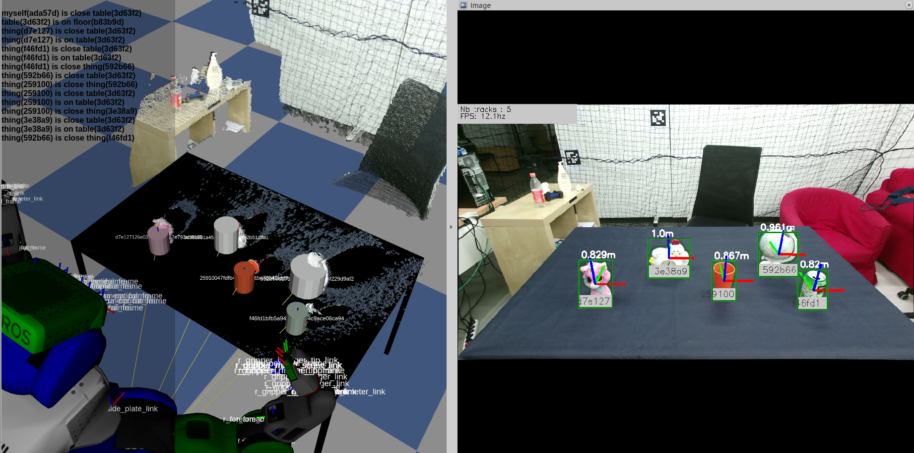
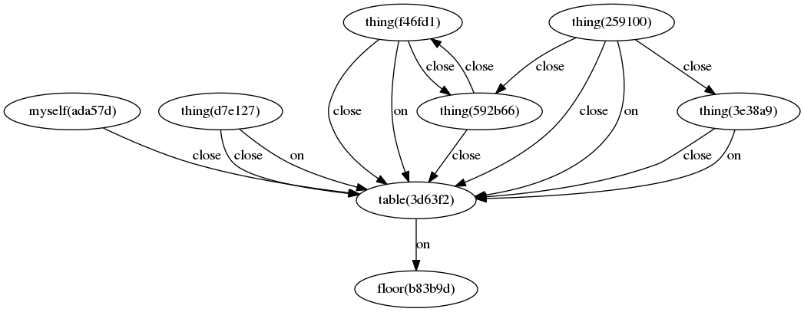

# Underworlds

#### Underworlds is a framework for physical, spatial and semantic reasoning for situation-assessment in the context of Human-Robot collaboration.

-----



In this example, the robot first detect and track the objects in the scene. Then the objects pose are being corrected by a physics engine in order to compute allocentric spatial relations.

This is resulting semantic scene graph:



This software is composed by two data-structures:
  1. A scene graph composed by scene nodes that contains the geometric and visual information.
  2. A timeline of temporal situations that contains temporal events that can represent an action, a fact or a caption.

It also contains differents modules to generate and maintain the scene graph and the timeline from the robot camera image by integrating a CPU based perception pipeline alongwith a real-time physics engine and a probabilistic triplet store.

Main features:
 - [x] Give to the robot physical sense of his body by using the simulation engine at runtime and the `/joint_states` topic published by the robot.
 * [x] Compute the view of the scene graph from any pose in the 3d space to latter process with image-based reasoning.
 * [x] Detect, explain and repairs beliefs divergeance by monitoring the view of the human it interact with (called the perspective).
 * [x] Correct small inconsistencies and infer the position of objects beyond the camera field of view by using physical reasoning and detect tabletop actions by analyzing inconsistency.
 * [ ] [WIP] Ground verbal expressions with rare/unknown or incomplete words by using fasttext embedding in order to match with current situations or nodes

More information in the [documentation](https://github.com/LAAS-HRI/uwds3/wiki).

## Modules available

### Static foreground detector


With

```
roslaunch uwds3 tabletop_object_perception.launch
```

### Human perception


## Quick start
**Note:** We assume that you have ROS installed, otherwise install it by following the instructions [here](https://wiki.ros.org/ROS/Installation).

In order to enable CUDA support (usefull for the MASK-RCNN detector), [follow this tutorial](https://www.pyimagesearch.com/2020/02/03/how-to-use-opencvs-dnn-module-with-nvidia-gpus-cuda-and-cudnn/) and to install the kinect2 drivers [follow this one](https://github.com/code-iai/iai_kinect2).

Then follow this instructions to install Underworlds:
```shell
cd ~/catkin_ws/src # go to your catkin workspace src folder
git clone https://github.com/LAAS-HRI/uwds3_msgs.git # clone the msgs definitions
git clone https://github.com/LAAS-HRI/uwds3.git # clone the lib repo
cd uwds3 # go to the lib repo root
./download_models.sh # download dnn models
./download_word_embeddings.sh #(optional) If you want to use static word embeddings
./install_dependencies.sh # install dependencies
cd ..
catkin build # build the project to install the pyuwds3 lib
```


# Quick launch

In different shells, run the following:
```shell
roslaunch uwds3 r2d2_upload.launch # upload a fake R2D2 robot
roslaunch uwds3 camera_publisher.launch # use the laptop/usb camera to fake the robot sensor
roslaunch uwds3 human_perception.launch
roslaunch uwds3 internal_simulator.launch
```

**IMPORTANT**: To be able to load the robot meshes in bullet you need to have the description package in the `catkin_ws/src` folder (exept for r2d2 that is composed only by simple primitives). One workaround is to create a symbolic link using the command `ln -s [target_file] [link_name]`.

Open Rviz in another shell with the command `rviz`, and add the following displays:
* Image display (topic : `human_perception`) # the people detected by the robot
* Image display (topic : `other_view`) # the perspective of the human in front of the robot
* MarkerArray display (topic : `corrected_tracks`) # display the world corrected by the physics engine

you can monitor the output topic of type `WorldStamped` by running:
```shell
rostopic echo /corrected_tracks
```

### Any problem ?

Please fill an issue with the error log and an example of code to reproduce the bug.

### How to contribute

To contribute to the project, fork the repo and make a pull request
